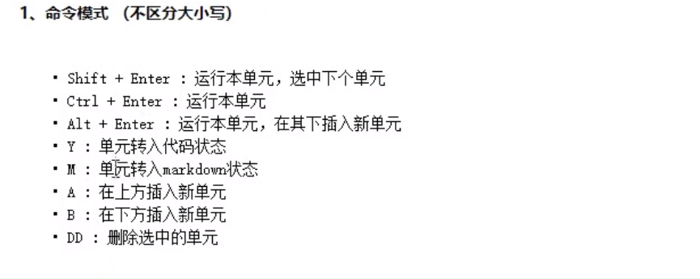
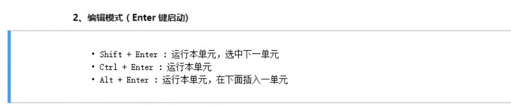
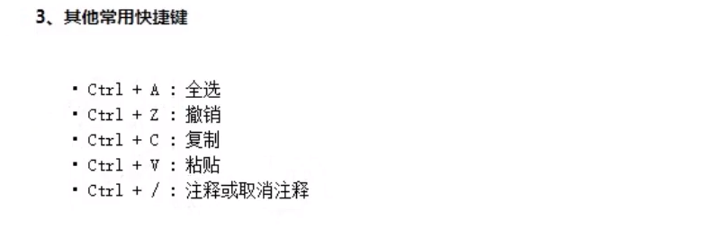
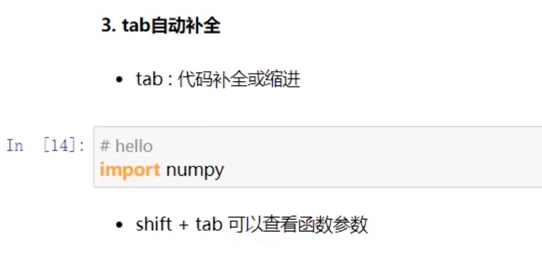

- 命令模式快捷键

**方框左边是绿色为命令模式**

- 编辑模式快捷键

**方框左边是蓝色为编辑模式**

- 其他常用快捷键

- tab 自动补全命令&`shift tab`查看函数参数

使用`shift tab`命令时，要在函数括号内使用

- 魔法命令

`%run *.py` 该命令打开不在该路径下的.`py`文件

`import *.py` 也可以打开不在该路径下的.`py`文件

`%time 文件名` 该命令计算文件的运行时间   一般用来统计耗时较长的程序执行时间

`%timeit 文件名` 该命令会多次运行文件，最后得到一个更为精准预期运行时间

`%%timeit 文件名` 两个百分号来测试多行代码的平均运行时间，一个百分号一般是测试一行代码的运行时间

`%who` 快速查看当前会话的所有变量和函数名称

`%whos` 快速查看当前会话的所有变量和函数名称详情

