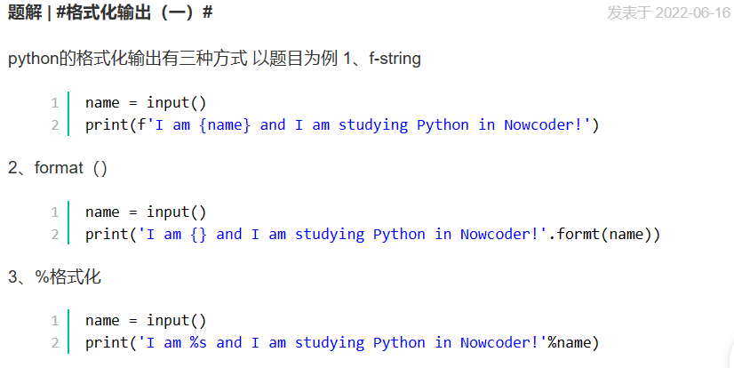

### 格式化输出

- 牛牛、牛妹和牛可乐正在Nowcoder学习Python语言，现在给定他们三个当中的某一个名字name，

  假设输入的name为Niuniu，则输出 I am Niuniu and I am studying Python in Nowcoder!

  请按以上句式输出相应的英文句子。

  

- ```python
  hex_str = input("请输入一个十六进制数字：")
  dec_num = int(hex_str, 16)
  print("十六进制数", hex_str, "转换成十进制数为：", dec_num)
  在上述代码中，我们首先使用input函数从用户那里读取一个十六进制的字符串，并将其存储在名为hex_str的变量中。然后，我们使用int函数，并指定第二个参数为16，将该十六进制字符串转换成十进制数字，并将结果存储在名为dec_num的变量中。最后，我们使用print函数将结果输出到屏幕上。
  
  当你运行这段代码时，程序会等待用户输入一个十六进制数字。一旦用户输入了该数字并按下Enter键，程序将把它转换成十进制数字，并将结果输出到屏幕上。
  
  需要注意的是，在Python中，可以使用int函数将一个字符串转换为整数。第二个参数指定了字符串所代表的数字的进制。在本例中，我们设置第二个参数为16，表示输入的字符串是一个十六进制数字。
  ```

```python
title()和capitalize()都是字符串的方法，用于将字符串中的单词进行格式化。

capitalize()方法会将字符串的第一个字符转换为大写，并将其余字符保持为小写。它只会对字符串的第一个字符做修改，不管其他字符的大小写。例如：
s = "hello world"
print(s.capitalize())  # 输出 "Hello world"
title()方法会将字符串中每个单词的第一个字符都转换为大写，而其余字符则保持为小写。它会根据空格或特定的分隔符将字符串分割成多个单词，并对每个单词的首字母进行大写转换。例如：
s = "hello world"
print(s.title())  # 输出 "Hello World"
两者的区别在于title()方法会对每个单词的首字母进行大写转换，而capitalize()方法仅对整个字符串的第一个字符进行大写转换。因此，title()方法更适合用于对整个句子或标题进行格式化。而capitalize()方法则更适合用于对单个字符串进行首字母大写的处理。
```

 