python基础知识

## 一 、标准数据类型

### 1、标准数据类型

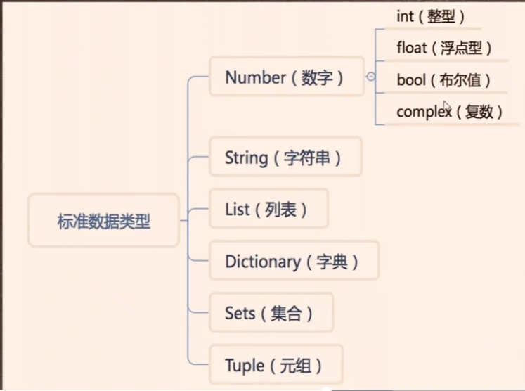

## 2、pycharm中批量注释按住crtl+?键

## 二、列表构建及索引操作

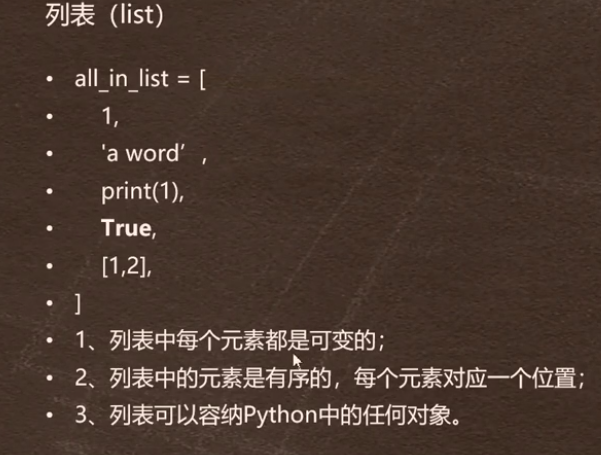

### 1、列表的索引

all_in_list = [0.3,'hello',True]

从左往右查找(索引)时，从0开始往后算，0、1、2、3........

相反，从右往左查找时，从-1开始算，-1，-2，-3......

### 2、列表的切片

res = all_in_list[0:2]

print(res)

[0.3,'hello']

列表的切片从0开始计算，左闭右开，顾头不顾尾..

### 3、列表的增添

all_in_list.append('pre-hello')  向列表里增添元素调用append方法

all_in_list.insert(0,'pre-hello') 向列表里增加元素还可以用insert方法

### 4、列表的删除

all_in_list.remove('pre-hello')  列表的删除可以调用remove方法

del all_in_list[0:2]   列表的删除还可以直接调用del函数

### 5、列表的修改

all_in_list[0]='hello world'  修改列表里的元素可以直接对列表里的元素赋值

### 6、更多列表的方法

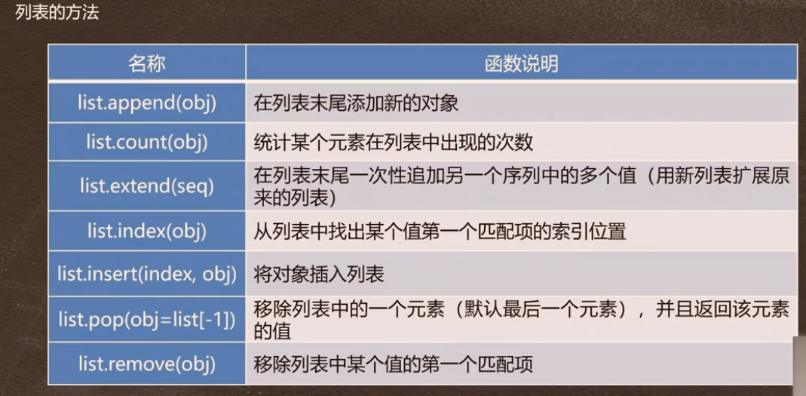

### 7、列表推导式

b = [i for i in range(1,11)]  左闭右开

print(b)

会得到一个数组[1,2,3,4,5,6,7,8,9,10]

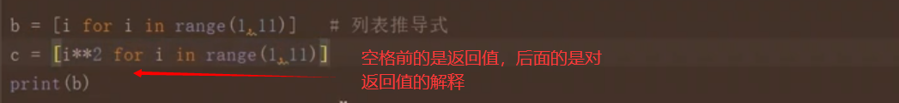

### 8、***练习一：求曲边图形的面积***

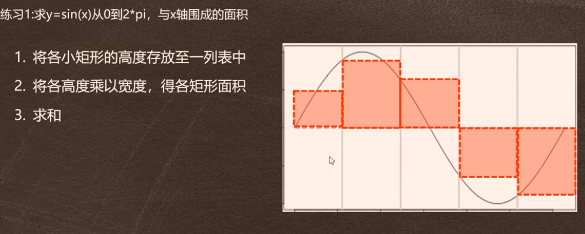

```python
# 练习1：求曲边图形的面积
import math

n = 10000  # n就是把2*pi均分成n等分，这里用了极限的思想
width = 2 * math.pi / n  # 每一份小矩形的宽度
# 方法一:利用for循环
x = []
y = []
for i in range(n):
    x.append(i * width)  # 得到包含每一个小矩形的宽度的数组
for i in x:
    y.append(abs(math.sin(i)))  # 得到每一个小矩形的长度的数组
S = sum(y) * width  # 先将长度求和再与宽度做积
print(S)

# 方法二:利用列表推导式
s = [abs(math.sin(i * width)) * width for i in range(n)]  # 利用列表推导式得到每一个小矩形的面积的数组
print(sum(s))
```

## 三、程序流程控制语句

## 1、python常用操作符

### 1.1算术操作符

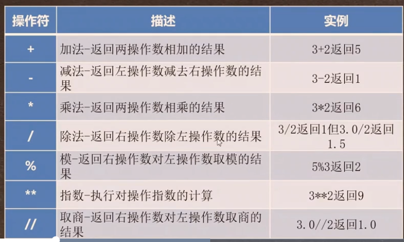

### 1.2赋值操作符

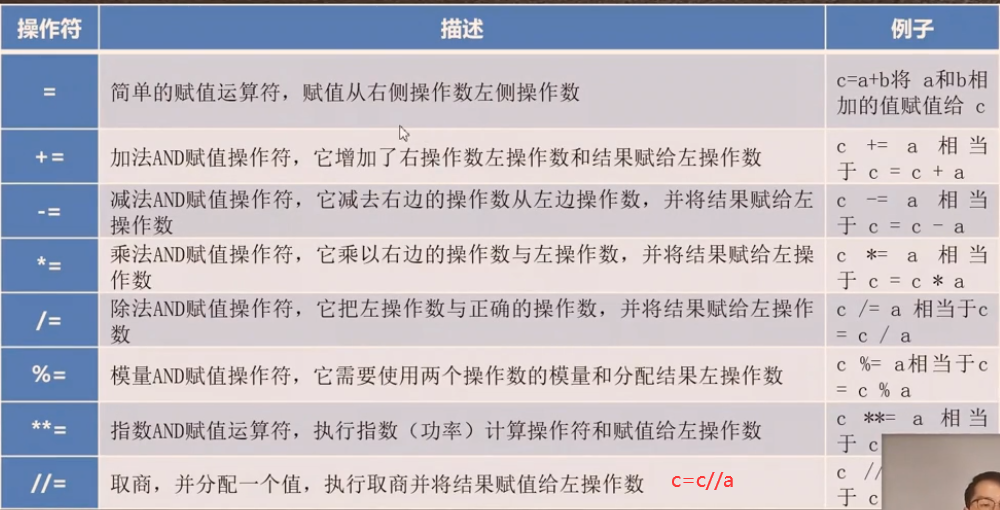

### 1.3 比较操作符

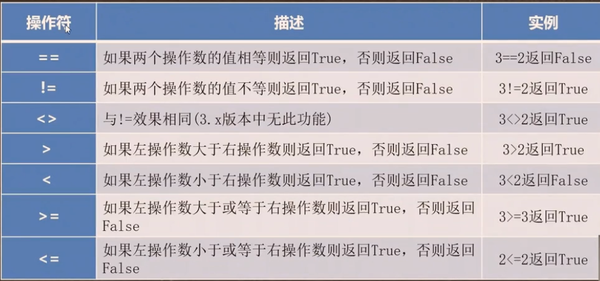

### 1.4 逻辑操作符

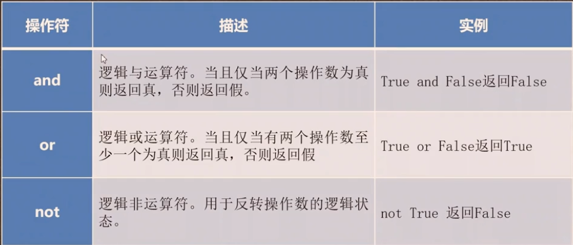

**在 Python 中，非零的整数值被视为 `True`，而零则被视为 `False`。**

## 2、python条件判定语句

if 语句

if 判断语句：

​    print('输出语句')

if 判断语句1：

​    print('输出语句1')

elif 判断语句2：

​	print('输出语句2')

else:

​	print('输出语句3')

## 3、***练习二：冒泡排序***

```python
x = [-7, -4.5, 0, 7, 4, 5, 9, 3.4, 7.8, 9.2, 1.1]
n = len(x)
print(n)
for i in range(n):
    for j in range(i):
        if x[j] > x[i]:
            x[i], x[j] = x[j], x[i]
print(x)
```

# 四、字符串操作

## 1、字符串及其索引&切片


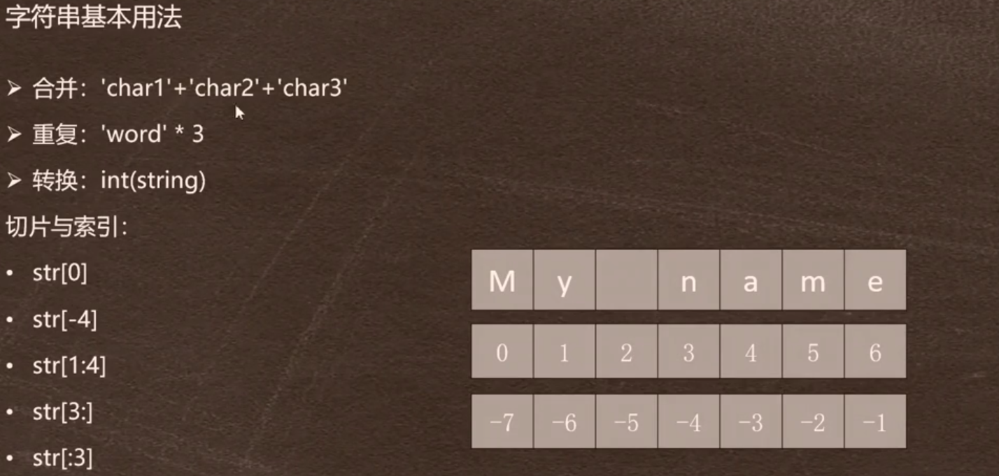

***`str[]`字符串切片是闭区间***

## 2、字符串的常见方法

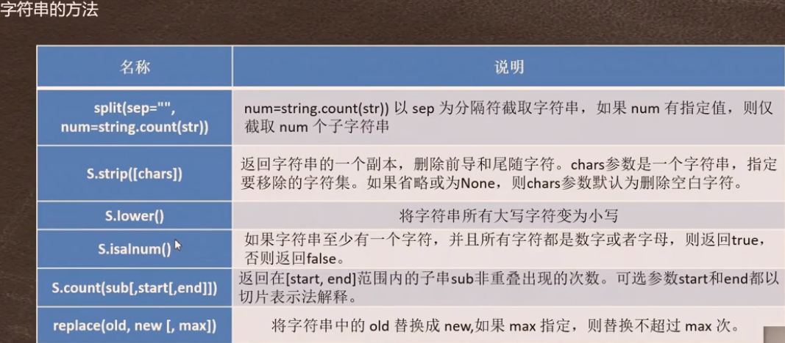

**字符串属于不可变的数据类型，不能对其直接进行修改**

## 3、字典的创建及索引

```python
在 Python 中，字典是一种无序的数据结构，用于存储键-值对。字典使用花括号 {} 来定义，并使用冒号 : 分隔键和值。下面是字典的基本语法：

my_dict = {key1: value1, key2: value2, key3: value3}
在这个语法中，my_dict 是字典的名称，key1、key2、key3 是键，value1、value2、value3 是对应的值。每个键和值之间使用冒号 : 进行分隔，不同的键-值对之间使用逗号 , 进行分隔。

以下是一个具体的例子：

student_scores = {'Alice': 85, 'Bob': 92, 'Charlie': 78}
在这个例子中，我们创建了一个名为 student_scores 的字典，其中包含三个学生的成绩信息。'Alice'、'Bob' 和 'Charlie' 是键，而 85、92 和 78 是对应的值。

你可以使用方括号 [] 来访问字典中的值，提供相应的键作为索引。例如，student_scores['Alice'] 将返回 85。
还可以使用 for 循环遍历字典的键或值，或者使用内置的方法来操作字典，如 keys()、values() 和 items()。

当需要遍历字典的键或值时，可以使用 for 循环结合字典的内置方法进行操作。下面是对 keys()、values() 和 items() 方法的详细介绍：
keys() 方法：该方法返回一个包含字典所有键的可迭代对象。可以将其用于遍历字典的键。
student_scores = {'Alice': 85, 'Bob': 92, 'Charlie': 78}
# 遍历字典的键
for key in student_scores.keys():
    print(key)
输出结果：
Alice
Bob
Charlie

values() 方法：该方法返回一个包含字典所有值的可迭代对象。可以将其用于遍历字典的值。
student_scores = {'Alice': 85, 'Bob': 92, 'Charlie': 78}
# 遍历字典的值
for value in student_scores.values():
    print(value)
输出结果：
85
92
78

items() 方法：该方法返回一个包含字典所有键值对的可迭代对象，每个键值对表示为一个元组。可以将其用于同时遍历字典的键和值。
student_scores = {'Alice': 85, 'Bob': 92, 'Charlie': 78}
# 遍历字典的键和值
for key, value in student_scores.items():
    print(key, value)
输出结果：
Alice 85
Bob 92
Charlie 78

使用这些方法可以方便地遍历字典的键、值或键值对，并在循环中执行相应的操作。你还可以结合条件语句和其他逻辑来进一步处理字典中的数据。
```


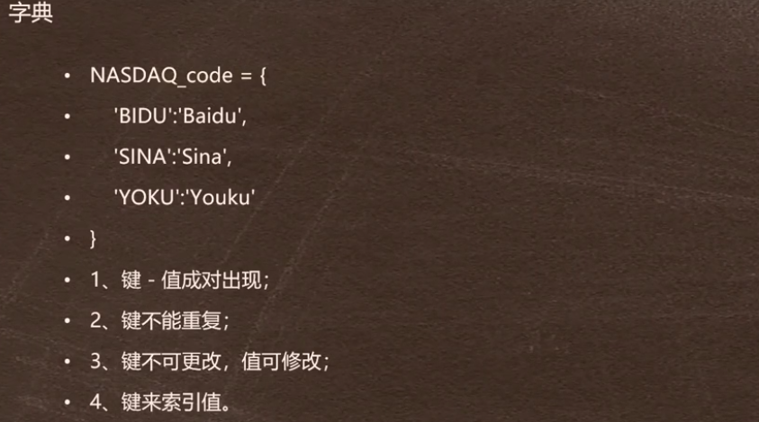

字典中的元素无先后顺序，通过键来访问值

字典中键不能重复，值可以重复，后面的会替换前面的值

```python
dic = {'h': 'hello', 'w': 'world', 0: 0.4, 'a': 'b', 'h': 'hehe'}
print(dic)
res = dic['h']
print(res)
```

## 4、字典元素的增删改查

修改元素 可以检索原来元素直接赋值

```python
dic['h'] = 100
```

 新增键值对

```python
dic = {'h': 'hello', 'w': 'world', 0: 0.4, 'a': 'b', 'h': 'hehe'}
dic['hw'] = 'hello world'
dic.update({1: 2, 3: 4})
print(dic)
#输出结果
{'h': 'hehe', 'w': 'world', 0: 0.4, 'a': 'b', 'hw': 'hello world', 1: 2, 3: 4} 
```

删除键值对

```python
del dic['h']
print(dic)
#输出结果及与原来对比
{'h': 'hehe', 'w': 'world', 0: 0.4, 'a': 'b', 'hw': 'hello world', 1: 2, 3: 4}
{'w': 'world', 0: 0.4, 'a': 'b', 'hw': 'hello world', 1: 2, 3: 4}
```

## 5、字典推导式

```python
dic1 = {i:i**2 for i in range(10)}
print(dic1)
#输出结果
{0: 0, 1: 1, 2: 4, 3: 9, 4: 16, 5: 25, 6: 36, 7: 49, 8: 64, 9: 81}
```

# 五、python文件操作

## 1、文件操作

```python
# 文件操作
f = open("文件名.txt", 'r')  # 逗号前输入要打开的文件，后缀不能丢，逗号后边的是打开文件的方式
txt = f.read()  # 读取文件内容
txt_lines = f.readlines()  # 读取文件内容,以行为单位读取内容，也就是一个换行符一条内容
f.close()  # 关闭文件，释放内存
print(txt)
```

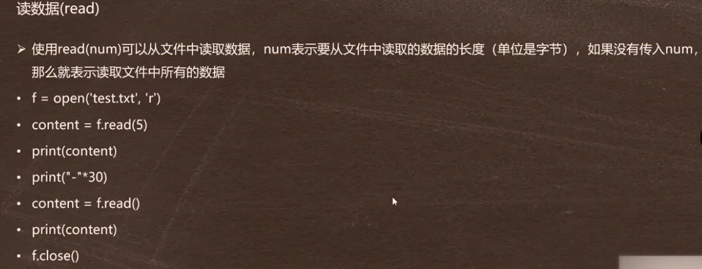

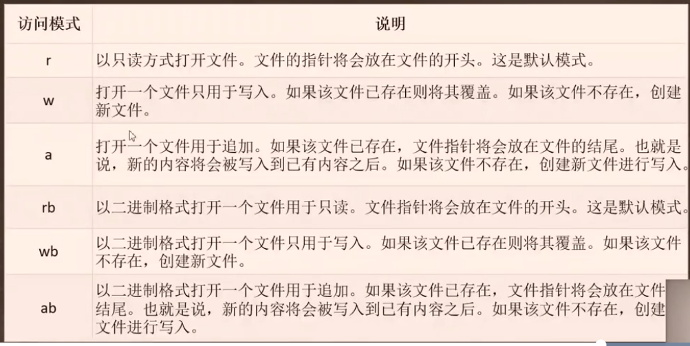

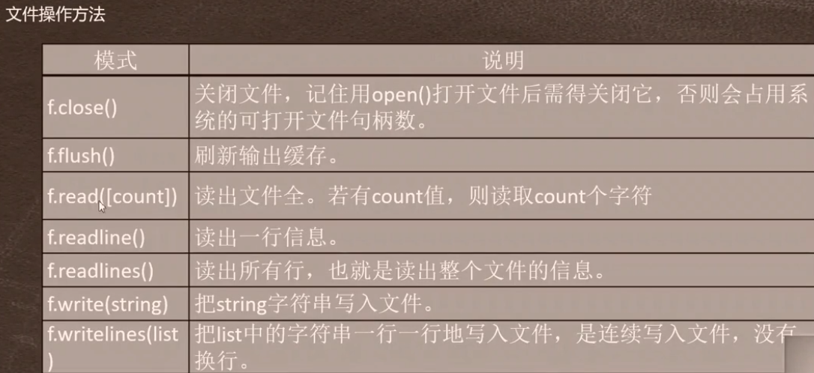

## 2、练习三 统计文件中的单词数

```python
import re
f = open('文件名称','r')
txt = f.read() #读取进来的数据是字符串
f.close()
txt = txt.lower() #将所有字母转化成小写
txt = re.sub('[,.?:"\'!-]','',txt)  #去除文本中的标点符号，将输入的标点符号替换为空，对象是txt文件
words = txt.split() #单词分割
word_sq = {} #建立一个空字典
for i in words:
    for i not in word_sq.keys():
        word_sq[i] = 1
    else:
        word_sq[i] += 1
 res = sorted(word_sq.items(),key=lambda x:x[1],reverse=True) #排序 lambda是自定义的一个函数，在下一章节中会详细介绍
print(res)

```

# 六、函数

## 1、python函数自定义

```python
#函数自定义
#第一种方式
def Sum(x,y):   #括号中的参数，左边如果赋值，右边一定要赋值，否则会报错。如果右边赋值左边不赋值则不报错
    return x+y
#第二种方式
y = lambda x:x**2  #利用lambda定义一个简单的函数，冒号左边是变量，右边是返回值
y = lambda x:x[1]
```

```python
在 Python 中，您可以使用 def 关键字来定义自定义函数。函数的语法格式如下：

def function_name(arguments):
    # 函数体
    # 执行函数操作
    return result
其中：

function_name 是您为函数选择的名称。
arguments 是函数的参数列表，可以包含零个或多个参数，每个参数以逗号分隔。
函数体 是函数的具体实现，包括要执行的操作、逻辑和算法等。
return 语句用于指定函数的返回值。可以选择性地返回一个或多个值。
以下是一个示例函数，它接受两个参数，并返回它们的和：

def add_numbers(x, y):
    sum = x + y
    return sum
您可以调用这个函数并传递参数来获取结果：

result = add_numbers(5, 3)
print(result)  # 输出 8
在以上示例中，我们定义了一个名为 add_numbers 的函数，它接受两个参数 x 和 y。函数体中计算了它们的和，并通过 return 语句返回了结果。然后，我们调用了这个函数，并打印了返回的结果。

在 Python 中，函数的参数不需要显式地规定类型。与一些其他编程语言不同，Python 是一种动态类型语言，它具有强大的灵活性。

这意味着在函数定义中，您无需指定参数的类型。您可以将任何类型的参数传递给函数，而不必事先声明参数的数据类型。Python 会根据实际传入的参数确定其类型。

以下是一个示例函数，展示了在函数定义和调用过程中无需指定参数类型：

def greet(name):
    greeting = "Hello, " + name + "!"
    return greeting

result = greet("Alice")
print(result)  # 输出 "Hello, Alice!"

result = greet(20)
print(result)  # 输出 "Hello, 20!"
在上述示例中，greet() 函数接受一个参数 name，它可以是任何类型。我们可以将字符串 "Alice" 或整数 20 作为参数传递给这个函数。Python 会根据实际传入的参数来确定 name 的类型，并在函数体内执行相应的操作。

虽然 Python 不要求指定参数类型，但这也意味着您需要在函数内部确保参数的类型正确，以避免潜在的错误。您可以使用条件语句、类型检查等方法来验证参数的类型。

总而言之，在 Python 中，函数的参数不需要规定类型，允许接受任意类型的参数。这是 Python 动态类型语言的一项特性。
```


## 2、练习四 自定义一个求序列偶数个数的函数

```python
def su(x):
    y = []
    for i in x:
        if i % 2 == 0:
            y.append(i)
    return y


res = su([1, 2, 3, 4, 5, 6, 7, 8, 9])
print(res)
```

## 3、python常见函数及应用

#### 3.1`append`函数

```python
append()是列表对象的一个方法，用于在列表的末尾添加一个元素。它的定义如下：

list.append(x)
其中，list表示列表对象，x表示要添加到列表末尾的元素。

使用append()方法时，会修改原始列表，并将指定的元素添加到列表的末尾。例如：

my_list = [1, 2, 3]
my_list.append(4)
print(my_list)  # 输出: [1, 2, 3, 4]
在上面的例子中，开始时my_list包含 [1, 2, 3]。然后，通过调用append(4)方法，将数字4添加到了列表的末尾，最终结果变为 [1, 2, 3, 4]。

值得注意的是，append()方法不会返回任何值，它直接操作修改了原始列表。因此，在使用append()时，不需要将其赋值给其他变量。
```

#### 3.2`insert`函数

```python
insert() 是列表对象的一个方法，用于在指定位置插入一个元素。它的语法如下：

list.insert(index, obj)
其中，list表示列表对象，index表示要插入新元素的索引（从0开始计数），obj表示要插入的元素。

使用 insert() 方法时，它会在指定的索引处插入一个新元素，并将原来索引位置以后的所有元素向后移动一个位置。例如：

my_list = [1, 2, 3]
my_list.insert(1, 'a')
print(my_list)  # 输出: [1, 'a', 2, 3]
在上面的例子中，开始时 my_list 包含 [1, 2, 3]。调用 insert(1, 'a') 方法会将字符串 'a' 插入到 my_list 的索引1处，并将原来索引为1及其之后的所有元素向后移动一个位置，最终结果变为 [1, 'a', 2, 3]。

值得注意的是，与 append() 不同，insert() 方法会影响到原始列表，并返回 None 而不是修改后的列表。
```

#### 3.3`split`函数

```python
split()是字符串的一个方法，用于根据指定的分隔符将字符串分割成多个子串，并将它们存储在列表中。它的语法如下：

str.split([sep[, maxsplit]])
其中，str表示要分割的字符串，sep表示用于分割字符串的分隔符，默认为所有空白字符（包括空格、制表符和换行符），maxsplit表示最大分割次数，默认为-1，表示不限制分割次数。

使用 split() 方法时，它会将指定字符串按照分隔符进行切割，并返回存储有所有分割后子串的列表。例如：

my_string = "The quick brown fox jumps over the lazy dog"
my_list = my_string.split()
print(my_list)  # 输出: ['The', 'quick', 'brown', 'fox', 'jumps', 'over', 'the', 'lazy', 'dog']
在上面的例子中，将字符串 "The quick brown fox jumps over the lazy dog" 赋值给变量 my_string。调用 split() 方法时，由于没有传入任何参数，因此根据默认分隔符（空白字符）将字符串分割成多个子串，并将它们存储在列表中。

你还可以自定义分隔符，例如：

my_string = "the,quick,brown,fox"
my_list = my_string.split(",")
print(my_list)  # 输出: ['the', 'quick', 'brown', 'fox']
在上面的例子中，将字符串 "the,quick,brown,fox" 赋值给变量 my_string。调用 split(",") 方法时，使用逗号作为分隔符将字符串分割成多个子串，并将它们存储在列表中。
```

#### 3.4`len`函数

```python
len() 是一个内置函数，用于返回对象的长度或元素个数。它的语法如下：

len(obj)
其中，obj表示要计算长度的对象，可以是字符串、列表、元组、字典、集合等。

使用 len() 函数时，它会返回给定对象中元素的数量。例如：

my_list = [1, 2, 3, 4, 5]
length = len(my_list)
print(length)  # 输出: 5
在上面的例子中，将列表 [1, 2, 3, 4, 5] 赋值给变量 my_list，然后调用 len() 函数计算列表的长度，并将结果赋值给变量 length，最终输出变量 length 的值为 5，表示该列表中有5个元素。

类似地，你还可以使用 len() 函数计算其他类型的对象的长度，比如字符串：

my_string = "Hello, World!"
length = len(my_string)
print(length)  # 输出: 13
在上面的例子中，将字符串 "Hello, World!" 赋值给变量 my_string，然后调用 len() 函数计算字符串的长度，并将结果赋值给变量 length，最终输出变量 length 的值为 13，表示该字符串由13个字符组成。
```

#### 3.5`input`函数

```python
input() 是一个内置函数，用于从用户处获取输入信息。它的语法如下：

input([prompt])
其中，prompt 是一个可选参数，用于在获取用户输入前向用户显示一个提示消息。

使用 input() 函数时，程序会暂停执行，等待用户在终端或命令行中输入信息。用户可以输入任意类型的数据，包括字符串、数字等。当用户按下回车键后，该函数会将用户输入的内容作为字符串返回。

以下是一个简单的示例：

name = input("请输入您的姓名：")
print("您好，" + name)
在这个例子中，调用 input() 函数并传入一个提示消息 "请输入您的姓名：" 。程序会在终端或命令行中显示该提示消息，并等待用户输入。用户可以在终端中输入他们的姓名，然后按下回车键。input() 函数会将用户输入的内容以字符串的形式返回，并将其赋值给变量 name。然后程序将打印出一条问候消息，其中包含用户输入的姓名。

需要注意的是，input() 函数返回的始终是一个字符串。如果需要将用户输入解释为其他类型（例如整数或浮点数），可以使用适当的转换函数（例如 int() 或 float()）将其转换为所需的类型。
```

#### 3.6`remove`函数

```python
remove() 是列表（list）的一个方法，用于从列表中移除指定值的元素。它的语法如下：

list.remove(obj)
其中，list表示要进行删除操作的列表，obj表示要从列表中移除的元素。

使用 remove() 方法时，它会从列表中寻找第一个等于指定元素的值，并将其移除。如果列表中不存在该元素，则会抛出 ValueError 异常。例如：

my_list = [1, 2, 3, 4, 5]
my_list.remove(3)
print(my_list)  # 输出: [1, 2, 4, 5]
在上面的例子中，将列表 [1, 2, 3, 4, 5] 赋值给变量 my_list，然后调用 remove(3) 方法移除列表中第一个值为 3 的元素。由于该元素存在于列表中，因此将其从列表中移除，并将剩余的元素 [1, 2, 4, 5] 存储在变量 my_list 中。

如果 remove() 方法尝试从列表中移除不存在的元素，则会引发 ValueError 异常。例如：

my_list = [1, 2, 3, 4, 5]
my_list.remove(6)  # 抛出 ValueError：list.remove(x): x not in list
在上面的例子中，尝试从列表 [1, 2, 3, 4, 5] 中移除值为 6 的元素。由于该元素不存在于列表中，因此会抛出 ValueError 异常。
```

#### 3.7`strip`函数

```python
strip() 是字符串的一个方法，用于去除字符串两端指定的字符（默认为空格）或字符序列。它的语法如下：

str.strip([chars])
其中，str 表示要进行处理的字符串，chars 是一个可选参数，表示要去除的字符或字符序列。

使用 strip() 方法时，它会从字符串的开头和结尾开始，连续地去除所有在 chars 参数中指定的字符或字符序列，直到遇到第一个不在 chars 中的字符为止。如果没有提供 chars 参数，则默认去除字符串两端的空格。

以下是一些示例：

str1 = "  hello world  "
str2 = "---hello---world---"
str3 = "   hello world"

print(str1.strip())     # 输出: "hello world"
print(str2.strip("-"))  # 输出: "hello---world"
print(str3.strip())     # 输出: "hello world"
在这些示例中，分别对字符串 str1、str2 和 str3 调用 strip() 方法。由于没有指定 chars 参数，它们都会删除字符串两端的空格字符。

需要注意的是，strip() 方法返回一个新的字符串，原始字符串并未被修改。如果需要将修改后的结果保存，可以将其赋值给一个新的变量。如果希望在原始字符串上进行修改，可以使用赋值运算符将其重新赋值。
```

#### 3.8`lower&upper`函数

```python
lower() 是字符串的一个方法，用于将字符串中的所有大写字母转换为小写字母。它的语法如下：

str.lower()
其中，str 表示要进行处理的字符串。

使用 lower() 方法时，它会将字符串中的所有大写字母转换为对应的小写字母，并返回一个新的字符串。原始字符串并未被修改。

以下是两个示例：

str1 = "Hello World"
str2 = "PYTHON"

print(str1.lower())  # 输出: "hello world"
print(str2.lower())  # 输出: "python"
在上面的示例中，分别对字符串 str1 和 str2 调用 lower() 方法。它们会将字符串中的所有大写字母转换为小写字母，并返回新的字符串。


str3 = "hello world"
str4 = "python"

print("Hello World")
print("PYTHON")
在上面的示例中，分别对字符串 str3 和 str4 调用了 upper()方法。 它们会将字符串中的小写字母转换为大写字母，并返回新的字符串。
需要注意的是，lower() 方法只会转换大写字母，而对于非字母字符不做任何改变，upper()只转换小写字母。
```

#### 3.9 `title和capitalize`函数的区别

```python
title() 和 capitalize() 都是字符串的方法，用于将字符串中的第一个字符转换为大写字母。它们的区别在于，title() 方法会将每个单词的第一个字符都转换为大写字母，而 capitalize() 方法只会将第一个单词的第一个字符转换为大写字母。

下面我们分别来介绍这两个方法的使用：

title()
title() 方法用于将字符串中每个单词的第一个字符转换为大写字母，其余字符转换为小写字母，返回新的字符串。示例如下：

string = "hello world, how are you?"
print(string.title()) # 输出: "Hello World, How Are You?"
在上面的示例中，title() 方法将字符串中每个单词的第一个字符转换为大写字母，其余字符都转换为小写字母，并返回了新的字符串。

capitalize()
capitalize() 方法用于将字符串中第一个字符转换为大写字母，返回新的字符串。示例如下：

string = "hello world"
print(string.capitalize()) # 输出: "Hello world"
在上面的示例中，capitalize() 方法将字符串中第一个字符 "h" 转换为大写字母 "H"，并返回了新的字符串。

需要注意的是，capitalize() 方法只会将第一个单词的第一个字符转换为大写字母，而后面的单词和字符不会改变。
```

#### 3.10`del`函数

```python
del 是 Python 的一个关键字，可以用于删除列表中的元素、删除变量或删除整个变量名。它的语法如下：

删除列表中的元素
del list[index]
其中，list 表示要进行操作的列表，index 表示要删除元素的下标。

使用 del 关键字时，它会将列表中指定下标的元素删除，并将后面的元素向前移动一个位置，使得列表中没有空的位置。如果指定的下标超出了列表的范围，会引发 IndexError 异常。

以下是一个示例：

my_list = [1, 2, 3, 4, 5]
del my_list[2]  # 删除下标为 2 的元素，即 3
print(my_list)  # 输出: [1, 2, 4, 5]
在上面的示例中，我们先定义了一个列表 my_list，然后使用 del 关键字删除下标为 2 的元素，即元素值为 3 的元素。最后打印列表，发现元素 3 已经被删除了。

删除变量或删除整个变量名
del var_name
其中，var_name 表示要删除的变量名。

使用 del 关键字删除变量时，它会将该变量从内存中删除，使得该变量名不能再被访问。如果试图访问已经被删除的变量名，会引发 NameError 异常。

以下是一个示例：

my_var = 10
del my_var # 删除变量名 my_var
print(my_var) # 试图访问已经被删除的变量名，会引发 NameError 异常
在上面的示例中，我们先定义了一个变量 my_var，然后使用 del 关键字删除该变量名，最后试图访问已经被删除的变量名 my_var，结果引发了 NameError 异常。

需要注意的是，使用 del 关键字删除列表中的元素或变量名时，它们都会从内存中被删除，因此谨慎使用以免误删。
```

#### 3.11`pop`函数

```python
pop() 是列表（list）的一个方法，用于删除并返回指定位置的元素。它可以在指定索引上删除列表中的元素，并返回被删除的元素值。pop() 的语法如下：

list.pop(index)
其中，list 是要进行操作的列表，index 是要删除的元素的索引。如果不指定索引，默认删除并返回列表中的最后一个元素。

下面是几个使用 pop() 方法的示例：

删除并返回指定索引的元素
my_list = [1, 2, 3, 4, 5]
removed_element = my_list.pop(2)  # 删除并返回索引为 2 的元素，即元素值为 3
print(my_list)  # 输出: [1, 2, 4, 5]
print(removed_element)  # 输出: 3
在上面的示例中，我们定义了一个列表 my_list，然后使用 pop() 方法删除索引为 2 的元素，即元素值为 3 的元素。删除后，列表变为 [1, 2, 4, 5]，同时被删除的元素值 3 被保存到 removed_element 变量中，并打印出来。

不指定索引，默认删除并返回最后一个元素
my_list = [1, 2, 3, 4, 5]
removed_element = my_list.pop()  # 默认删除并返回最后一个元素，即元素值为 5
print(my_list)  # 输出: [1, 2, 3, 4]
print(removed_element)  # 输出: 5
在上面的示例中，我们同样定义了一个列表 my_list，但这次没有指定索引，而是使用 pop() 方法默认删除并返回最后一个元素。删除后，列表变为 [1, 2, 3, 4]，同时被删除的元素值 5 被保存到 removed_element 变量中，并打印出来。

需要注意的是，如果指定的索引超出了列表的范围，会引发 IndexError 异常。因此，在使用 pop() 方法时，确保提供的索引是有效的
```

#### 3.12`sorted`函数

```python
sorted() 是 Python 内置的一个函数，用于对可迭代对象进行排序操作。它接受一个可迭代对象作为参数，并返回一个新的已排序的列表（或者是其他可迭代对象，取决于传入参数的类型）。

sorted() 的语法如下：
sorted(iterable, key=None, reverse=False)
其中:
iterable：表示要排序的可迭代对象，例如列表、元组、字符串等。
key：用于指定一个函数（通常是匿名函数）来从每个元素中提取一个比较键。排序将根据这些键来进行，而不是直接使用元素进行排序。该参数是可选的。
reverse：表示是否按逆序进行排序，默认为 False，表示升序排序。如果设置为 True，则表示降序排序。该参数也是可选的。
以下是几个使用 sorted() 函数的示例：

对列表进行排序
my_list = [3, 1, 4, 2, 5]
sorted_list = sorted(my_list)
print(sorted_list)  # 输出: [1, 2, 3, 4, 5]
在上面的示例中，我们定义了一个列表 my_list，然后使用 sorted() 函数对该列表进行排序。排序后，生成一个新的已排序列表并赋值给 sorted_list 变量，并打印出来。

对字符串进行排序
my_string = 'hello'
sorted_string = sorted(my_string)
print(sorted_string)  # 输出: ['e', 'h', 'l', 'l', 'o']
在上面的示例中，我们定义了一个字符串 my_string，然后使用 sorted() 函数对该字符串进行排序。排序后，生成一个新的已排序列表并赋值给 sorted_string 变量，并打印出来。注意，字符串被拆分成单个字符进行排序。

使用键函数进行排序
my_list = ['apple', 'banana', 'orange', 'grape']
sorted_list = sorted(my_list, key=lambda x: len(x))
print(sorted_list)  # 输出: ['grape', 'apple', 'banana', 'orange']
在上面的示例中，我们定义了一个列表 my_list，并使用键函数 lambda x: len(x) 来指定以字符串长度作为排序的依据。根据字符串的长度对列表进行排序后，生成一个新的已排序列表并赋值给 sorted_list 变量，并打印出来。

需要注意的是，sorted() 函数并不会修改原始的可迭代对象，而是返回一个新的已排序的对象。
```

#### 3.13`sort`函数

```python
sort() 是列表（list）的一个方法，用于对列表进行原地排序。它会修改原始列表，在排序完成后，原始列表的元素顺序会被改变。

sort() 的语法如下：

list.sort(key=None, reverse=False)
其中:

key：用于指定一个函数（通常是匿名函数）来从每个元素中提取一个比较键。排序将根据这些键来进行，而不是直接使用元素进行排序。该参数是可选的。
reverse：表示是否按逆序进行排序，默认为 False，表示升序排序。如果设置为 True，则表示降序排序。该参数也是可选的。
以下是几个使用 sort() 方法的示例：

对列表进行排序
my_list = [3, 1, 4, 2, 5]
my_list.sort()
print(my_list)  # 输出: [1, 2, 3, 4, 5]
在上面的示例中，我们定义了一个列表 my_list，然后使用 sort() 方法对该列表进行排序。排序完成后，原始列表 my_list 的元素顺序被改变，并打印出来。

使用键函数进行排序
my_list = ['apple', 'banana', 'orange', 'grape']
my_list.sort(key=len)
print(my_list)  # 输出: ['grape', 'apple', 'banana', 'orange']
在上面的示例中，我们同样定义了一个列表 my_list，并使用键函数 len 来指定以字符串长度作为排序的依据。根据字符串的长度对列表进行排序后，原始列表 my_list 的元素顺序被改变，并打印出来。

需要注意的是，与 sorted() 不同，sort() 方法直接在原始列表上进行排序，而不生成一个新的已排序列表。因此，使用 sort() 会改变原始列表的顺序。
```

**`sort与sorted`函数均默认升序排序,若想将其修改为降序,则需将reverse设置为True**

#### 3.14`reverse`函数

```python
reverse() 是列表对象的方法，用于将列表中的元素进行反转（翻转），也就是将列表中的元素顺序颠倒过来。 reverse() 方法没有返回值，它会直接在原始列表上进行修改。

reverse() 方法的语法如下：

list.reverse()
其中，list 指代要进行反转操作的列表对象。

以下是一个使用 reverse() 方法的例子：

my_list = [1, 2, 3, 4, 5]
my_list.reverse()
print(my_list)  # 输出：[5, 4, 3, 2, 1]
在上面的例子中，我们定义了一个列表 my_list，并使用 reverse() 方法对其进行反转。结果，原始列表 my_list 中的元素顺序被改变，从而得到了反转后的新列表 [5, 4, 3, 2, 1]。

需要注意的是，与 sort() 方法类似，reverse() 方法也是直接在原始列表上进行修改的，并且它没有返回值。如果你想要得到一个新的已反转列表，可以先使用切片的方式复制一份原始列表，再对复制后的列表进行反转操作。
```

#### 3.15[python的格式化输出](E:\python学习\python的格式化输出.md)

详细命令请点击链接查看

#### 3.16 map函数

```python
map() 函数是 Python 的一个内置函数，它的作用是将一个函数应用于一个可迭代对象（迭代器），并返回一个由结果组成的迭代器。

map() 函数的定义如下：

map(function, iterable, ...)
其中：

function: 要应用于每个元素的函数。该函数可以是任何可调用对象，例如一个函数、lambda 函数、方法等。

iterable: 可迭代对象，它可以是一个序列（如列表、元组、字符串）、一个迭代器、一个集合或任何支持迭代协议的对象。

map() 函数的工作原理如下：

对于给定的 iterable 中的每个元素，map() 函数都会调用 function，并将该元素作为参数传递给它。然后，将返回值添加到结果列表中，最后返回结果列表。如果有多个可迭代对象，则 map() 函数将并行地迭代它们。

以下是一些使用 map() 函数的示例：

将列表中的每个元素转换为字符串
lst = [1, 2, 3, 4, 5]
result = list(map(str, lst))
print(result)  # ['1', '2', '3', '4', '5']

计算两个列表中相应元素的平均值
a = [1, 2, 3, 4, 5]
b = [10, 11, 12, 13, 14]
result = list(map(lambda x, y: (x + y) / 2, a, b))
print(result)  # [5.5, 6.5, 7.5, 8.5, 9.5]

将输入的字符串列表转换为浮点数列表
lst = ['1.2', '2.4', '3.6', '4.8']
result = list(map(float, lst))
print(result)  # [1.2, 2.4, 3.6, 4.8]
```

#### 3.17 in 方法

```python
in 是 Python 中的一个运算符，用于检查一个值是否存在于某个集合（如列表、元组、字符串）中。

in 运算符的使用形式如下：

value in collection
其中，value 是要检查是否存在的值，而 collection 则是作为集合的对象。

in 运算符的工作原理如下：

如果 collection 是一个列表、元组或字符串，in 运算符将检查 value 是否与其中的任何元素相等。

对于列表和元组，如果存在与 value 相等的元素，则返回 True，否则返回 False。
对于字符串，如果 value 是一个子字符串，则返回 True，否则返回 False。
如果 collection 是一个字典，in 运算符将检查 value 是否为字典的键之一。

如果 value 是一个字典的键，返回 True，否则返回 False。
以下是一些使用 in 运算符的示例：

# 检查列表中的元素
lst = [1, 2, 3, 4, 5]
print(3 in lst)     # True
print(6 in lst)     # False

# 检查字符串中的子字符串
text = "Hello, world!"
print("world" in text)      # True
print("python" in text)     # False

# 检查字典中的键
d = {"a": 1, "b": 2, "c": 3}
print("a" in d)     # True
print("d" in d)     # False
在上面的示例中，in 运算符用于检查列表、字符串和字典中的元素或键是否存在。
```

#### 3.18` bin函数 & hex函数 & oct函数 & int函数`

```python
bin() 是一个 Python 内置函数，用于将整数转换为二进制字符串表示形式。

bin() 函数的使用方式如下：

bin(x)
其中 x 是要转换为二进制的整数值。

bin() 函数的返回值是一个以 '0b' 开头的二进制字符串。'0b' 表示这个字符串是一个二进制数的标识。

如果你只希望得到二进制数的字符串表示形式，而不需要 '0b' 前缀，可以使用切片操作 [2:] 或者 format() 函数来去除前缀。

以下是一些 bin() 函数的示例：
x = 10
print(bin(x))   # '0b1010'

# 去除前缀 '0b'
bin_str = bin(x)[2:]
print(bin_str)  # '1010'

# 使用 format() 函数
bin_str = format(x, 'b')
print(bin_str)  # '1010'

在上面的示例中，我们使用 bin() 函数将整数 x 转换为二进制字符串，并展示了如何去除前缀 '0b'。
format() 函数是 Python 内置函数，用于将数值转换为指定格式的字符串。

在上述代码中，format(x, 'b') 表示将整数 x 格式化为二进制字符串。其中，'b' 是格式化字符串的格式指示符，表示将数值转换为二进制表示形式。

下面是对 format() 函数的使用示例：
x = 10
bin_str = format(x, 'b')
print(bin_str)  # '1010'
在上面的示例中，我们使用 format() 函数将整数 x 格式化为二进制字符串，并将结果赋值给变量 bin_str。最后，我们打印出 bin_str 的值，即 '1010'。

需要注意的是，使用 format() 函数时，可以通过设定格式指示符来指定输出的格式。例如，'b' 表示二进制，'d' 表示十进制，'o' 表示八进制，'x' 表示十六进制等等。

-----------------------------------------------------------------------------------------------------

hex()函数
在Python环境下，可以使用内置函数hex()将数字转换为十六进制字符串。下面是一个示例：
num = 255
hex_string = hex(num)
print(hex_string)
这将输出字符串"0xff"，因为255的十六进制表示为0xff。

如果你想要去掉前缀"0x"，可以使用切片操作来获取除开前两个字符的部分：

num = 255
hex_string = hex(num)[2:]
print(hex_string)
这将输出字符串"ff"。

请注意，hex()函数返回的是一个字符串，如果你需要进行进一步的数值计算，可能需要使用int()函数将十六进制字符串转换回整数类型。例如：

hex_string = "ff"
num = int(hex_string, 16)
print(num)
这将输出整数255。在int()函数中，第二个参数16表示输入的字符串是十六进制数。

-----------------------------------------------------------------------------------------------------

oct()函数
在Python中，你可以使用内置函数oct()将十进制数转换为八进制数。下面是一个示例：
num = 255
oct_string = oct(num)
print(oct_string)
这将输出字符串"0o377"，因为255的八进制表示为0o377。

如果你想要去掉前缀"0o"，可以使用切片操作来获取除开前两个字符的部分：

num = 255
oct_string = oct(num)[2:]
print(oct_string)
这将输出字符串"377"。

请注意，oct()函数返回的是一个字符串，如果你需要进行进一步的数值计算，可能需要使用int()函数将八进制字符串转换回整数类型。例如：

oct_string = "377"
num = int(oct_string, 8)
print(num)
这将输出整数255。在int()函数中，第二个参数8表示输入的字符串是八进制数。

-----------------------------------------------------------------------------------------------------

int()函数
在Python中，int()函数用于将字符串或数字转换为整数。它的语法如下：

int(x, base=10)
其中，x是要转换的字符串或数字，base是进制数，默认为10（十进制）。如果x是一个字符串，则必须指定base参数。

下面是一些示例：

# 将字符串转换为整数
num_str = "123"
num = int(num_str)
print(num)

# 将十六进制字符串转换为整数
hex_str = "ff"
num = int(hex_str, 16)
print(num)

# 将八进制字符串转换为整数
oct_str = "377"
num = int(oct_str, 8)
print(num)
这些示例分别将字符串"123"、十六进制字符串"ff"和八进制字符串"377"转换为整数。在第二个和第三个示例中，int()函数的第二个参数指定了输入字符串的进制数。

请注意，如果x无法被转换为整数，int()函数将会抛出ValueError异常。因此，在使用int()函数时，应该确保输入参数的类型和格式正确。
```

#### 3,19 `tuple`函数

```python
元组的语法很简单，可以通过以下方式创建一个元组：

my_tuple = (element1, element2, element3, ...)
其中 element1、element2、element3 等是元组中的元素，它们可以是任意的数据类型（如整数、字符串、列表等）。

另外，对于只包含一个元素的元组，在元素后面需要加上一个逗号 , 作为区分，以防止与括号内的表达式混淆。

例如：
empty_tuple = ()
single_tuple = (1,)
name_tuple = ("John", "Doe")
mixed_tuple = (1, "apple", [3, 4], ("a", "b"))
在创建元组后，您可以使用索引访问元组中的元素，索引从0开始。也可以使用切片操作获取元组的子集。元组索引切片时为闭区间.

my_tuple = (1, 2, 3)
print(my_tuple[0])  # 输出：1
print(my_tuple[1:])  # 输出：(2, 3)
虽然元组不可变，但是可以进行一些基本操作，如连接（使用 + 运算符）和重复（使用 * 运算符）。

tuple1 = (1, 2)
tuple2 = ("a", "b")
combined_tuple = tuple1 + tuple2  # 元组连接
repeated_tuple = tuple1 * 3  # 元组重复
这样，combined_tuple 将会是 (1, 2, "a", "b")，而 repeated_tuple 将会是 (1, 2, 1, 2, 1, 2)。
```

#### 3.20 zip函数

```python
zip函数是Python内置的一个函数，它可以将多个可迭代对象（例如列表、元组等）中对应位置的元素打包成一个新的元组，并返回一个可迭代的zip对象。zip函数的基本语法如下：

zip(*iterables)
其中，*iterables表示传入的可迭代对象，可以是多个，也可以是一个可迭代对象。

zip函数的工作原理是，它会从每个可迭代对象中依次取出对应位置的元素，将这些元素打包成一个元组，并返回一个包含这些元组的zip对象。zip对象可以通过list()函数或者直接遍历来查看或使用其中的元组。

下面是一些使用zip函数的例子：

numbers = [1, 2, 3]
letters = ['a', 'b', 'c']

# 将两个列表中对应位置的元素打包成元组
zipped = zip(numbers, letters)
print(list(zipped))  # [(1, 'a'), (2, 'b'), (3, 'c')]

# 可以传入多个可迭代对象
names = ['Alice', 'Bob', 'Charlie']
ages = [25, 30, 35]
zipped = zip(names, ages, numbers)
print(list(zipped))  # [('Alice', 25, 1), ('Bob', 30, 2), ('Charlie', 35, 3)]

# 如果传入的可迭代对象长度不一致，zip函数会以最短的可迭代对象为准
a = [1, 2, 3]
b = ['a', 'b']
zipped = zip(a, b)
print(list(zipped))  # [(1, 'a'), (2, 'b')]

# 可以使用解压缩操作符*将zip对象拆分成多个列表
zipped = [('Alice', 25), ('Bob', 30), ('Charlie', 35)]
names, ages = zip(*zipped)
print(names)  # ('Alice', 'Bob', 'Charlie')
print(ages)   # (25, 30, 35)
需要注意的是，zip函数返回的是一个zip对象，如果要查看其中的元组，可以通过list()函数将其转换为列表。另外，zip函数会以最短的可迭代对象的长度为准进行打包，如果传入的可迭代对象长度不一致，会截断多余的部分。

如何使用zip函数将两个列表合并成一个字典
要使用zip函数将两个列表合并成一个字典，可以将两个列表作为参数传递给zip函数，并将zip对象转换为字典。

下面是一个示例：

python
keys = ['name', 'age', 'gender']
values = ['Alice', 25, 'female']

# 使用zip函数将两个列表合并成一个字典
result = dict(zip(keys, values))
print(result)  # {'name': 'Alice', 'age': 25, 'gender': 'female'}
在上述示例中，keys列表包含了字典的键，values列表包含了字典的值。通过调用zip(keys, values)将两个列表打包成一个zip对象，然后使用dict()函数将zip对象转换为字典。
```

#### 3.21 dict函数

```python
dict()函数是Python内置的一个函数，用于创建字典对象。它可以从可迭代对象、关键字参数等不同的输入形式来创建字典。

下面是一些使用dict()函数的常见方式：

从关键字参数创建字典：
# 使用关键字参数创建字典
person = dict(name='Alice', age=25, gender='female')
print(person)  # {'name': 'Alice', 'age': 25, 'gender': 'female'}
在上述示例中，通过将关键字参数传递给dict()函数，可以直接创建一个包含指定键值对的字典。

从可迭代对象创建字典：
# 使用可迭代对象创建字典
items = [('name', 'Alice'), ('age', 25), ('gender', 'female')]
person = dict(items)
print(person)  # {'name': 'Alice', 'age': 25, 'gender': 'female'}
在上述示例中，将包含键值对的可迭代对象（如列表、元组）传递给dict()函数，可以根据可迭代对象中的元素创建字典。

从其他字典或映射对象创建字典：
# 从其他字典或映射对象创建字典
person = dict({'name': 'Alice', 'age': 25, 'gender': 'female'})
print(person)  # {'name': 'Alice', 'age': 25, 'gender': 'female'}
在上述示例中，可以使用其他字典或映射对象作为参数传递给dict()函数来创建一个新的字典。

需要注意的是，当使用可迭代对象创建字典时，可迭代对象中的元素应该是包含键值对的元组或列表，其中第一个元素表示键，第二个元素表示值。如果可迭代对象中的元素不符合要求，或者出现重复的键，可能会导致错误。

此外，dict()函数还可以用于创建空字典，即不传递任何参数时，将返回一个空字典对象：

python
empty_dict = dict()
print(empty_dict)  # {}
总而言之，dict()函数是一个非常有用的函数，可以根据不同的输入形式创建字典对象。
```

#### 3.21 print函数

```python
print()函数是Python中用于输出内容到控制台的内置函数。它可以接受一个或多个参数，并将它们打印到标准输出（通常是终端窗口）。

以下是print()函数的基本语法：

print(value1, value2, ..., sep=' ', end='\n', file=sys.stdout, flush=False)
value1, value2, ...：要打印的值，可以是一个或多个参数。
sep=' '：可选参数，用于指定打印多个值之间的分隔符，默认为一个空格字符。
end='\n'：可选参数，用于指定打印结束后的字符，默认为换行符（\n）。
file=sys.stdout：可选参数，用于指定输出的文件对象，默认为标准输出（终端窗口）。
flush=False：可选参数，用于指定是否刷新输出缓冲区，默认为False。
下面是一些示例，演示如何使用print()函数：

# 打印单个值
print("Hello, world!")

# 打印多个值，使用空格作为分隔符
print(1, 2, 3, 4, 5)

# 使用自定义分隔符
print("apple", "banana", "orange", sep=', ')

# 不换行打印多个值
print(1, 2, 3, end=' ')

# 打印到文件
with open('output.txt', 'w') as f:
    print("Hello, file!", file=f)
这些示例演示了print()函数的一些常见用法。你可以根据需要使用不同的参数来自定义输出的格式和目标位置。
```

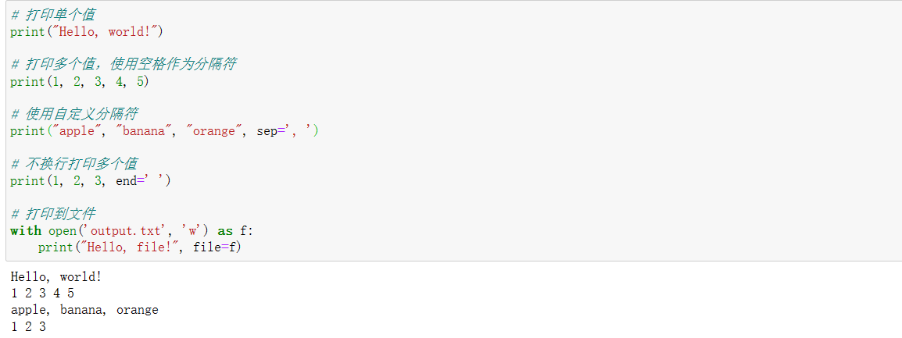

#### 3.22 ord函数

```python
ord()函数是Python内置函数之一，用于返回给定字符的Unicode码（整数表示）。它接受一个字符串（只包含一个字符）作为参数，并返回对应字符的Unicode码。

下面是一个使用ord()函数的示例代码：

char = input("请输入一个字符：")
unicode_value = ord(char)
print("字符 {} 的Unicode码是：{}".format(char, unicode_value))
代码解析：

char = input("请输入一个字符：")：使用input()函数接收用户输入的字符，并将其赋值给变量char。

unicode_value = ord(char)：使用ord()函数获取变量char所表示字符的Unicode码，并将结果赋值给变量unicode_value。

print("字符 {} 的Unicode码是：{}".format(char, unicode_value))：使用print()函数打印出字符和对应的Unicode码。通过字符串格式化，将字符和Unicode码插入到输出语句中。

当你运行这段代码并输入一个字符后，程序将返回该字符的Unicode码作为输出。例如，如果你输入字符'A'，则程序会输出：字符 A 的Unicode码是：65。

需要注意的是，ord()函数只接受一个字符作为参数。如果传入的字符串长度超过1个字符，或者为空字符串，则会引发TypeError异常。

```

